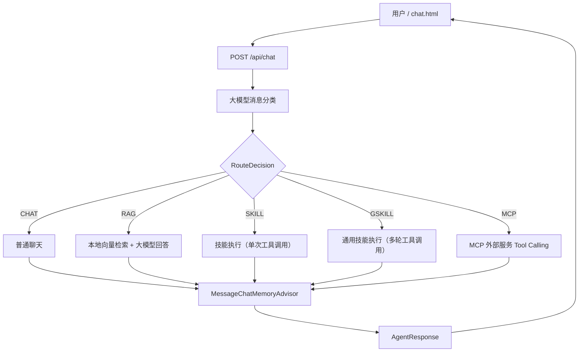
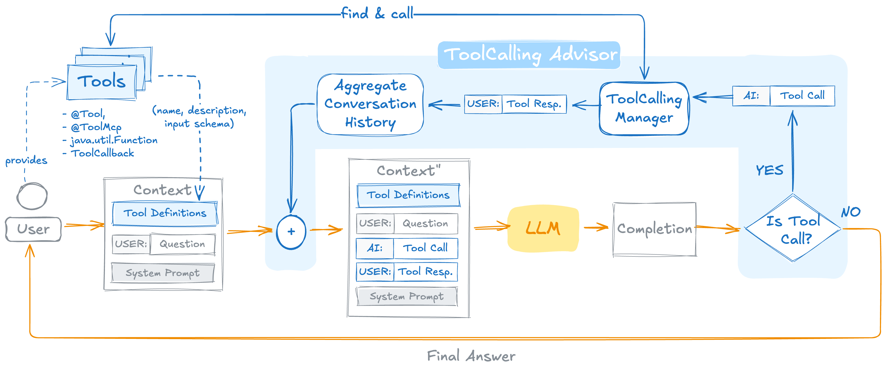

# Sagent

Sagent 是一个基于 Spring AI 2.0 的智能 Agent 示例项目，实现了多类型消息路由、工具调用、技能系统等核心功能。

用户发送消息后，系统先调用大模型进行消息分类，再根据分类结果路由到普通聊天、RAG 知识库检索、数据库查询、技能执行或通用技能执行流程。聊天模型通过 OpenRouter 调用，Embedding 模型在本地 JVM 中运行。

## 功能特性

- **智能消息分类**：支持 `CHAT`、`RAG`、`SKILL`、`GSKILL`、`MCP` 五种消息类型
- **普通聊天**：基于 OpenRouter 的多轮对话能力
- **RAG 知识库检索**：本地 ONNX Embedding + `SimpleVectorStore` 实现高效检索
- **SKILL 企业固定技能**：单次调用单一工具，不进入工具调用循环
  - `WebPageDownloadSkill`：网页下载处理（截图、下载内容、下载媒体、压缩打包）
- **GSKILL 通用技能**：由大模型决定调用工具计划，支持多轮工具调用循环
  - `DataBaseSkill`：H2 内存数据库查询
  - `AlarmSkill`：获取时间、设置闹钟
- **MCP 外部服务**：通过 MCP 协议调用外部工具（计算器、天气、股票查询等），采用延迟初始化，不影响主应用启动
- **文件管理**：支持生成的文档、图片和压缩包下载，图片显示缩略图，点击可下载原图
- **多轮会话记忆**：基于 `MessageChatMemoryAdvisor` 的会话管理
- **前端界面**：Vue 2 + Element UI 聊天测试页面
- **详细响应**：返回路由类型、分类理由和 RAG 来源

## 技术栈

| 技术 | 版本或用途 |
| --- | --- |
| JDK | 21 |
| Spring Boot | 4.1.0 |
| Spring AI | 2.0.0 |
| OpenRouter | OpenAI 兼容聊天接口 |
| Transformers | 本地运行 ONNX Embedding |
| SimpleVectorStore | 内存向量库 |
| H2 | 内存数据库 |
| Vue 2 / Element UI | 聊天页面 |

## 工作流程



**设计要点**：
- 分类器会读取历史消息来理解上下文，但不会使用会自动写入消息的记忆 Advisor，避免把 `RouteDecision` 写入正式聊天记录
- 五个最终处理分支共享同一份会话记忆
- SKILL 单次调用单一工具，不进入工具调用循环
- GSKILL/MCP 工具调用循环由 Spring AI 的 `ToolCallingAdvisor` 自动处理

## 项目结构

```text
src/main/java/com/example/sagent
├─ agent
│  ├─ core          Agent 核心调度层
│  │  ├─ AgentHandler      处理器接口
│  │  └─ AgentService      Agent 服务（消息路由）
│  ├─ handlers      Agent 处理器实现
│  │  ├─ ChatHandler       普通聊天处理器
│  │  ├─ RagHandler        RAG 检索处理器
│  │  ├─ SkillHandler      SKILL 企业技能处理器
│  │  ├─ GSkillHandler     GSKILL 通用技能处理器
│  │  └─ McpHandler        MCP 外部服务处理器
│  ├─ skills        技能实现
│  │  ├─ Skill             SKILL 接口
│  │  ├─ GSkill            GSKILL 接口
│  │  ├─ DataBaseSkill     数据库查询技能（GSKILL）
│  │  ├─ WebPageDownloadSkill  网页下载技能（SKILL）
│  │  └─ AlarmSkill            闹钟技能（GSKILL）
│  ├─ tools         工具类
│  │  ├─ VectorKnowledgeRetriever  向量知识库检索器
│  │  ├─ CompressionTool       文件压缩工具
│  │  └─ WebPageTool           网页下载工具（截图、下载内容、下载媒体）
│  ├─ memory        会话记忆
│  │  ├─ ChatMemoryConfiguration  聊天记忆配置
│  │  └─ ConversationHistory     会话历史管理
│  ├─ model         数据模型
│  │  ├─ AgentType         Agent 类型枚举
│  │  ├─ AgentResponse     响应模型
│  │  ├─ HandlerResult     处理器结果
│  │  ├─ RouteDecision     路由决策
│  │  └─ Product           产品实体
│  └─ routing       消息路由
│     └─ MessageClassifier  消息分类器
└─ controller       HTTP 接口
   ├─ ChatController   聊天接口
   └─ FileController   文件管理接口

src/main/resources
├─ embedding        内嵌 ONNX Embedding 模型
├─ knowledge        本地知识库文档
├─ static           chat.html 及前端依赖
├─ schema.sql       H2 表结构
├─ data.sql         H2 演示数据
└─ application.yml  应用配置
```

## 运行项目

### 环境要求

- JDK 21
- Maven 3.9+
- OpenRouter API Key

不需要安装 Ollama、Python、Node.js、MySQL 或 Redis。

### 配置 OpenRouter

必须设置环境变量：

```text
OPENROUTER_API_KEY
```

可选指定模型：

```text
OPENROUTER_MODEL
```

**安全提示**：不要把真实 API Key 写入 `application.yml` 或提交到 Git。

### 启动 MCP Server（可选）

MCP 功能采用**延迟初始化**设计：agentdemo 启动时不会连接 MCP Server，只在首次收到 MCP 类型请求时才建立连接。因此无需 MCP 时可直接启动 agentdemo。

如需测试 MCP 功能，先启动 MCP Server：

```bash
cd mcpserver
mvn spring-boot:run
```

MCP Server 默认监听 `http://localhost:8081/mcp`，提供以下工具：
- `calculator`: 计算器（支持加减乘除）
- `get_weather`: 获取指定城市天气（北京/上海/广州/深圳/成都）
- `get_stock_price`: 获取股票实时价格（AAPL/GOOGL/MSFT/TSLA/NVDA/BABA/JD）
- `get_system_info`: 获取系统信息
- `echo`: 回显消息（测试用）

MCP Server 地址通过 `mcp.server.url` 配置（默认 `http://localhost:8081/mcp`），可在 `application.yml` 中覆盖。

### 启动 Agent Demo

**Windows PowerShell**：

```powershell
$env:OPENROUTER_API_KEY = "你的真实Key"
$env:OPENROUTER_MODEL = "openrouter/free"
cd agentdemo
mvn spring-boot:run
```

**macOS / Linux**：

```bash
export OPENROUTER_API_KEY="你的真实Key"
export OPENROUTER_MODEL="openrouter/free"
cd agentdemo
mvn spring-boot:run
```

**IDEA 配置**：
将 Project SDK 设置为 JDK 21，并在 `Run -> Edit Configurations -> Environment variables` 中添加环境变量。

## 聊天页面

启动后访问：

```text
http://localhost:8080/chat.html
```

页面功能：
- 多轮 Agent 对话
- 路由类型和分类原因展示
- RAG 来源展示
- 请求耗时展示
- 停止请求
- 清空页面和服务端会话记忆
- 下载链接渲染（SKILL 生成的文件，图片显示缩略图）

页面使用项目内的 Vue 和 Element UI 资源，不需要前端构建。

## API 接口

### 发送消息

```http
POST /api/chat?conversationId=demo-1
Content-Type: application/json
```

请求体：

```json
"OPENROUTER_API_KEY 在哪里配置？"
```

响应：

```json
{
  "conversationId": "demo-1",
  "answer": "项目从 OPENROUTER_API_KEY 环境变量读取 API Key。",
  "type": "RAG",
  "routeReason": "用户询问项目配置",
  "sources": [
    "sagent-overview.md"
  ],
  "latencyMs": 1500
}
```

**参数说明**：
- `conversationId`（可选）：会话 ID，不传时服务端自动生成
- `message`：用户消息内容

**注意**：当前接口一次性返回完整 JSON，不是 SSE 流式响应。

### 文件下载

```http
GET /files/download/{fileName}
```

下载 SKILL 生成的文件（Markdown、文本、图片、压缩包等）。支持子目录路径（如 `/files/download/folderName/file.png`）。

### 列出文件

```http
GET /files/list
```

列出所有可下载的文件，包含子目录路径。

## 测试示例

### 普通聊天

```text
你好，请介绍一下你自己。
```

### RAG 知识库查询

```text
OPENROUTER_API_KEY 在哪里配置？
Why was 1998 SH2 reclassified as a comet?
What does WHO recommend to reduce dementia risk?
```

### 数据库查询（GSKILL）

```text
数据库里有多少个产品？
查询价格不超过 70 元的产品。
```

### SKILL 网页下载

```text
下载这个网页 https://example.com 并生成文档。
截取百度首页的截图。
下载网页中的图片。
抓取网页内容并转换为 Markdown。
```

### GSKILL 通用技能

```text
现在几点了？
帮我设置一个5分钟后的闹钟。
```

### MCP 外部服务

```text
帮我算一下 123 + 456
查询北京的天气
苹果股价现在多少？
获取系统信息
```

### 多轮记忆

```text
第一轮：介绍一下 NASA 的那篇新闻。
第二轮：它为什么被重新分类？
```

## 自动化测试

```bash
mvn test
```

测试覆盖：
- 消息分类器测试（`MessageClassifierTests`）
- 产品数据库工具测试（`ProductDatabaseToolsTests`）
- 向量知识库检索器测试（`VectorKnowledgeRetrieverTests`）

## 注意事项

- 会话记忆、向量库和 H2 数据都保存在内存中，应用重启后会清空
- 每个会话最多保留 20 条消息
- RAG 知识文件位于 `src/main/resources/knowledge`
- 数据库 Tool 只提供查询方法，没有新增、修改或删除操作
- SKILL 生成的文件保存在系统临时目录（`%TEMP%/sagent-downloads/`），应用重启后会清空
- MCP 客户端采用延迟初始化：不注册为 Spring Bean，由 `McpHandler` 在首次 MCP 请求时手动创建连接，避免启动时因 MCP Server 未就绪而导致应用启动失败。若连接失败会返回友好提示，不会阻塞其他功能
- 这是学习和功能验证项目，生产环境还需要鉴权、限流、持久化和安全审查

## 附录：工具调用循环

Spring AI 2.0 将工具调用循环从 ChatModel 内部抽取为 `ToolCallingAdvisor` 递归顾问，作为顾问链的一部分统一管理。



**核心机制**：

1. `ToolCallingAdvisor` 是递归顾问，通过 `callAdvisorChain.copy(this)` 创建子链进行循环调用
2. `ChatClient` 自动注册 `ToolCallingAdvisor`（默认优先级 `HIGHEST_PRECEDENCE + 300`）
3. 循环过程：注入工具定义 → 调用LLM → 执行工具 → 回填结果 → **再次调用LLM** → 循环
4. 停止条件：LLM 返回不含工具调用的最终响应

**关键流程**：
- 循环的主体是**调用工具**，每次循环都会调用LLM来决定是否继续调用工具
- 每次工具调用后，结果会追加到对话历史，然后**再次调用LLM**
- 最终LLM根据所有工具结果，生成自然语言回复给用户

**应用只需**：
- 通过 `.tools()` 注册工具对象
- 使用 `@Tool` 注解定义可调用方法

## License

MIT License