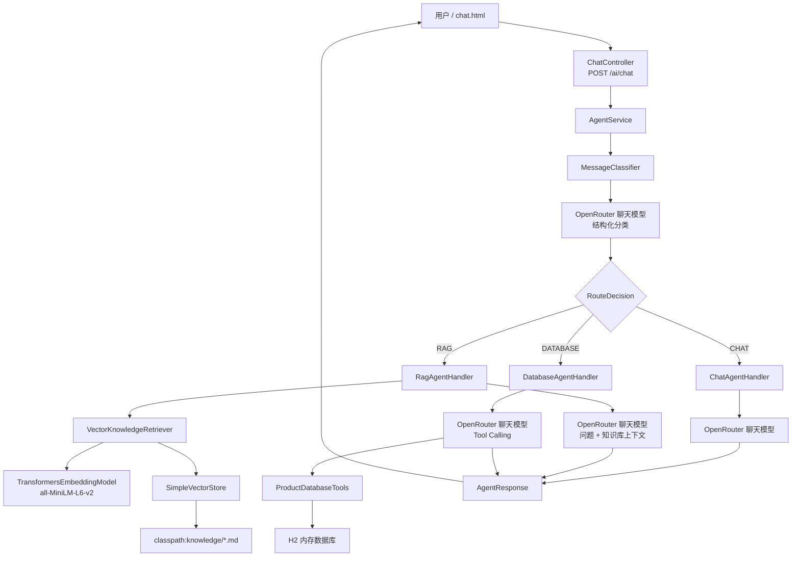
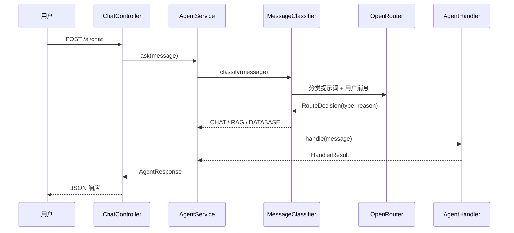
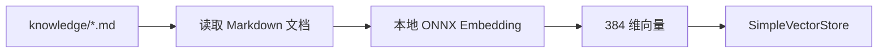
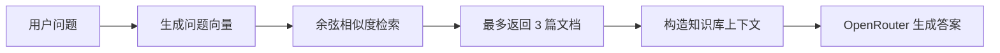
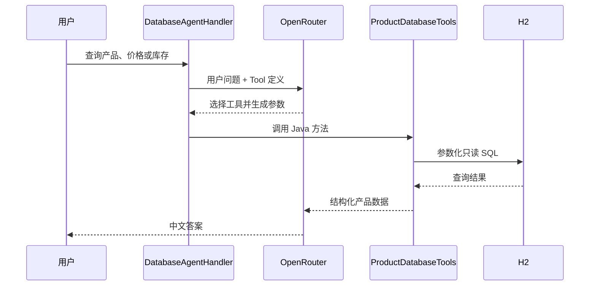

# Sagent

Sagent 是一个用于学习和验证 Spring AI Agent 能力的最小完整示例项目。

项目接收用户消息后，先调用大模型判断消息类型，再将请求分发到普通聊天、
RAG 知识库检索或数据库查询流程。聊天和路由模型通过 OpenRouter 调用，
Embedding 模型则使用项目内嵌的 ONNX 模型在本地运行。

项目提供一个基于 Vue 2 和 Element UI 的聊天页面，可以直观看到回答内容、
路由类型、路由原因、知识库来源和请求耗时。

## 核心功能

- 使用大模型将用户消息分类为 `CHAT`、`RAG` 或 `DATABASE`
- 普通问题直接调用 OpenRouter 聊天模型回答
- 知识问题通过本地 Embedding 和内存向量库完成 RAG 检索
- 数据库问题由大模型选择只读 Java Tool，并查询 H2 数据库
- 使用结构化输出将模型分类结果转换为 Java `RouteDecision`
- 返回路由类型、分类原因和 RAG 文档来源
- 提供可直接访问的 Agent 聊天测试页面
- 内嵌 ONNX Embedding 模型，无需安装 Ollama
- 支持 Windows、macOS 和 Linux

## 技术栈

| 技术 | 版本或用途 |
| --- | --- |
| JDK | 21 |
| Spring Boot | 4.1.0 |
| Spring AI | 2.0.0 |
| Maven | 项目构建和依赖管理 |
| OpenRouter | OpenAI 兼容的聊天模型接口 |
| Spring AI Transformers | 在 JVM 中运行 ONNX Embedding 模型 |
| all-MiniLM-L6-v2 | 384 维本地 Embedding 模型 |
| SimpleVectorStore | 内存向量存储和相似度检索 |
| H2 | 内存关系型数据库 |
| JdbcClient | 执行参数化数据库查询 |
| Vue 2 | 聊天页面状态和交互 |
| Element UI | 页面组件和样式 |

## 总体架构



## 请求处理流程



## 消息分类原理

`MessageClassifier` 首先向 OpenRouter 发送分类提示词。提示词要求模型只能选择
以下三种类型之一：

| 类型 | 适用场景 |
| --- | --- |
| `CHAT` | 闲聊、写作、翻译、总结、通用知识 |
| `RAG` | Sagent 项目文档、Agent 路由规则、使用手册、本地英文新闻 |
| `DATABASE` | 产品名称、分类、价格、库存、数量等结构化数据 |

分类结果不是靠字符串截取，而是使用 Spring AI 结构化输出：

```java
public record RouteDecision(AgentType type, String reason) {
}
```

```java
chatClient.prompt()
        .system(CLASSIFICATION_PROMPT)
        .user(message)
        .call()
        .entity(RouteDecision.class, spec -> spec.validateSchema());
```

Spring AI 根据 `RouteDecision` 生成结构要求，并将模型返回值转换成 Java 对象。
如果模型调用失败、格式无效或没有返回类型，系统会降级到 `CHAT`，避免请求完全失败。

`AgentService` 使用 `AgentType` 查找对应的 `AgentHandler`，因此新增处理类型时，
可以继续实现统一的处理器接口：

```java
public interface AgentHandler {

    AgentType type();

    HandlerResult handle(String message);
}
```

## 普通聊天流程

`ChatAgentHandler` 直接把用户消息交给 OpenRouter 聊天模型：

```text
用户问题
  -> MessageClassifier 判断为 CHAT
  -> ChatAgentHandler
  -> OpenRouter
  -> 返回答案
```

普通聊天不会访问知识库，也不会调用数据库工具。

## RAG 实现原理

RAG 是 Retrieval-Augmented Generation，即“检索增强生成”。

本项目的 RAG 分为知识库初始化和用户查询两个阶段。

### 知识库初始化



应用启动时，`VectorKnowledgeRetriever` 会：

1. 扫描 `classpath*:knowledge/*.md`
2. 将每个 Markdown 文件转换成一个 Spring AI `Document`
3. 使用 `TransformersEmbeddingModel` 生成 384 维向量
4. 将原文、来源文件名和向量写入 `SimpleVectorStore`

当前知识库包括：

- Sagent 项目说明
- Agent 消息路由说明
- NASA 英文新闻
- CERN 英文新闻
- WHO 英文新闻

### 用户查询



查询参数：

| 参数 | 当前值 |
| --- | --- |
| 最大结果数 | 3 |
| 相似度阈值 | 0.1 |
| 向量库 | `SimpleVectorStore` |
| Embedding 模型 | `all-MiniLM-L6-v2` |
| 向量维度 | 384 |

检索到的文档会被拼接成以下形式：

```text
[来源: news-nasa-comet.md]
文档内容...
```

随后 `RagAgentHandler` 将用户问题和知识库上下文一起发送给 OpenRouter。
系统提示词要求模型只能依据上下文回答；如果知识库内容不足，需要明确说明。

接口响应中的 `sources` 会包含实际命中的知识文件名，聊天页面也会显示这些来源。
IDEA 控制台会打印每次检索命中的文档和相似度分数。

### 本地 Embedding 模型

模型文件位于：

```text
src/main/resources/embedding/all-MiniLM-L6-v2/
├── model.onnx
├── tokenizer.json
└── README.md
```

模型和分词器通过 `classpath:` 加载，不需要在运行时下载 Embedding 模型：

```yaml
spring:
  ai:
    model:
      embedding: transformers
    embedding:
      transformer:
        onnx:
          model-uri: classpath:/embedding/all-MiniLM-L6-v2/model.onnx
        tokenizer:
          uri: classpath:/embedding/all-MiniLM-L6-v2/tokenizer.json
```

`all-MiniLM-L6-v2` 体积较小、英文效果较好，适合本项目中的英文新闻检索。
它不是以中文为主训练的模型，因此复杂中文语义检索效果有限。

### 当前 RAG 限制

- 一个 Markdown 文件当前作为一个完整文档，没有进行分段
- `SimpleVectorStore` 只保存在内存中，应用重启后会重新建立索引
- 文档数量较少，尚未实现增量添加、删除和更新
- 没有使用持久化向量数据库
- 默认 Embedding 模型主要面向英文
- 没有实现关键词检索与向量检索的混合召回

## 数据库查询原理

数据库问题不会让大模型直接编写并执行任意 SQL。



`ProductDatabaseTools` 使用 `@Tool` 和 `@ToolParam` 描述工具能力。大模型根据：

- 方法描述
- 参数名称
- 参数说明
- 用户问题

选择合适的方法并构造参数。

当前提供的只读工具：

| Java 方法 | 功能 |
| --- | --- |
| `listProducts()` | 查询全部产品，最多 20 条 |
| `findProductsByName(keyword)` | 按名称模糊查询 |
| `findProductsByMaxPrice(maxPrice)` | 查询不高于指定价格的产品 |
| `findProductById(id)` | 按 ID 查询产品 |
| `countProducts()` | 统计产品总数 |

所有查询通过 `JdbcClient` 参数绑定执行。项目没有暴露新增、修改、删除工具，
也没有向模型提供执行任意 SQL 的入口。

H2 使用内存模式：

```yaml
spring:
  datasource:
    url: jdbc:h2:mem:sagent;DB_CLOSE_DELAY=-1;MODE=MySQL
```

应用启动时自动执行：

- `schema.sql`：创建 `products` 表
- `data.sql`：插入 5 条演示产品数据

应用停止后，H2 中的数据会消失，下次启动时重新初始化。

## Web 聊天页面

启动项目后访问：

```text
http://localhost:8080/chat.html
```

页面功能：

- 发送 Agent 消息
- 显示普通聊天、RAG 检索或数据库查询标签
- 显示大模型给出的路由原因
- 显示 RAG 命中的知识库来源
- 显示请求耗时
- 支持停止当前浏览器请求
- 支持清空聊天记录
- 支持 Enter 发送、Shift + Enter 换行

Vue、Element UI 和字体资源均已放在静态资源目录，不需要安装 Node.js 或执行
前端构建命令。

## 项目目录

```text
sagent
├── pom.xml
├── README.md
└── src
    ├── main
    │   ├── java/com/example/sagent
    │   │   ├── SagentApplication.java
    │   │   ├── controller
    │   │   │   └── ChatController.java
    │   │   └── agent
    │   │       ├── chat
    │   │       ├── core
    │   │       ├── database
    │   │       ├── model
    │   │       ├── rag
    │   │       └── routing
    │   └── resources
    │       ├── application.yml
    │       ├── schema.sql
    │       ├── data.sql
    │       ├── embedding
    │       ├── knowledge
    │       └── static
    │           └── chat.html
    └── test
        └── java/com/example/sagent
```

## 运行要求

必须安装或准备：

- JDK 21
- IntelliJ IDEA 或本地 Maven
- 可访问 Maven 仓库的网络
- OpenRouter API Key

不需要安装：

- Ollama
- Python
- Node.js
- MySQL
- Redis
- 独立向量数据库
- CUDA

第一次启动时，Maven 会下载项目依赖，DJL 可能下载当前操作系统对应的 CPU
原生运行库。Embedding 模型本身已经放在项目资源目录中。

## 配置 OpenRouter

项目使用 Spring AI 的 OpenAI 兼容客户端访问 OpenRouter：

```yaml
spring:
  ai:
    openai:
      base-url: https://openrouter.ai/api/v1
      api-key: ${OPENROUTER_API_KEY:not-configured}
      chat:
        base-url: https://openrouter.ai/api/v1
        options:
          model: ${OPENROUTER_MODEL:openrouter/free}
```

必须设置：

```text
OPENROUTER_API_KEY
```

可选设置：

```text
OPENROUTER_MODEL
```

如果没有设置 `OPENROUTER_MODEL`，默认使用：

```text
openrouter/free
```

不要把真实 API Key 写进 `application.yml` 或提交到 Git。

### IDEA 配置

1. 打开 `File -> Project Structure`
2. 将 Project SDK 设置为 JDK 21
3. 打开 `Run -> Edit Configurations`
4. 选择 `SagentApplication`
5. 在 Environment variables 中加入：

```text
OPENROUTER_API_KEY=你的真实Key
```

可选指定模型：

```text
OPENROUTER_MODEL=模型名称
```

6. 运行 `SagentApplication`

操作系统环境变量在 IDEA 启动后发生变化时，需要重启 IDEA，或者直接在 Run
Configuration 中配置。

### Windows PowerShell

```powershell
$env:OPENROUTER_API_KEY = "你的真实Key"
$env:OPENROUTER_MODEL = "openrouter/free"
mvn spring-boot:run
```

### macOS / Linux

```bash
export OPENROUTER_API_KEY="你的真实Key"
export OPENROUTER_MODEL="openrouter/free"
mvn spring-boot:run
```

## API

项目只提供 POST 聊天接口：

```http
POST /ai/chat
Content-Type: application/json
```

请求体：

```json
{
  "message": "OPENROUTER_API_KEY 在哪里配置？"
}
```

响应示例：

```json
{
  "answer": "项目从 OPENROUTER_API_KEY 环境变量读取 API Key。",
  "type": "RAG",
  "routeReason": "用户询问项目配置，属于本地知识库内容",
  "sources": [
    "sagent-overview.md"
  ]
}
```

使用 curl：

```bash
curl -X POST http://localhost:8080/ai/chat \
  -H "Content-Type: application/json" \
  -d '{"message":"Why was 1998 SH2 reclassified as a comet?"}'
```

接口当前是一次性返回完整 JSON，不是 SSE 流式响应。

## 测试问题

### 普通聊天

```text
请用三句话介绍 Spring Boot。
帮我写一段项目周报。
把 hello world 翻译成中文。
```

### RAG 项目知识

```text
Sagent 使用哪个 JDK 版本？
Agent 消息会被分成哪几类？
OPENROUTER_API_KEY 在哪里配置？
```

### RAG 英文新闻

```text
Why was 1998 SH2 reclassified as a comet?
How did CMS study matter-antimatter differences?
What does WHO recommend to reduce dementia risk?
```

### 数据库查询

```text
数据库里一共有多少个产品？
列出价格不超过 100 元的产品。
查询名称中包含“课程”的产品。
ID 为 3 的产品是什么？
```

## 自动化测试

使用 JDK 21 执行：

```bash
mvn test
```

当前测试覆盖：

- Agent 根据分类结果调用正确的处理器
- H2 演示数据初始化和只读查询
- Spring Boot 上下文启动
- 生产环境注入真实 `TransformersEmbeddingModel`
- 项目知识文档向量检索
- NASA、CERN、WHO 英文新闻向量检索

## 响应对象

后端统一返回：

```java
public record AgentResponse(
        String answer,
        AgentType type,
        String routeReason,
        List<String> sources
) {
}
```

字段说明：

| 字段 | 含义 |
| --- | --- |
| `answer` | Agent 最终回答 |
| `type` | 实际选择的处理流程 |
| `routeReason` | 分类模型给出的简短理由 |
| `sources` | RAG 命中的知识文件；其他类型为空数组 |

## 后续扩展方向

- 将 `SimpleVectorStore` 替换为 PGvector、Redis、Qdrant 或 Milvus
- 使用中文或多语言 Embedding 模型提升中文语义检索
- 对长文档进行切分，并保存标题、段落、时间等元数据
- 增加关键词与向量混合检索
- 使用 Reranker 对初次召回结果重新排序
- 增加对话记忆和多轮会话 ID
- 将一次性 JSON 响应升级为 SSE 流式输出
- 增加写操作审批流程和人工确认节点
- 为路由、检索、工具调用增加可观测性和耗时统计
- 将 H2 替换为真实业务数据库

## 重要说明

这是一个用于学习和功能验证的示例项目，不是完整的生产系统。

生产环境至少还需要考虑：

- API 鉴权和访问控制
- 限流、超时、重试和熔断
- Prompt 注入防护
- Tool 权限和参数校验
- 敏感信息脱敏
- 持久化数据库和向量库
- 日志、指标和调用链追踪
- 模型输出审查
- 高风险操作的人工确认

## 许可证

本项目使用 [MIT License](LICENSE)。
