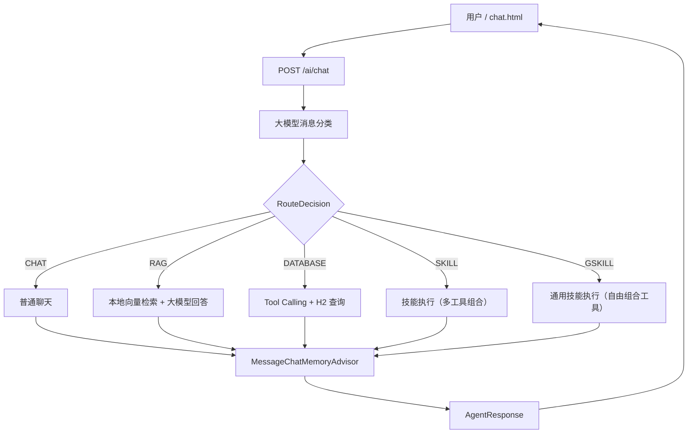

# Sagent

Sagent 是一个用于学习 Spring AI Agent 的示例项目。

用户发送消息后，系统先调用大模型分类，再进入普通聊天、RAG 知识库检索、
数据库查询、技能执行或通用技能执行流程。聊天模型通过 OpenRouter 调用，Embedding 模型在本地 JVM 中运行。

## 功能

- 大模型消息分类：`CHAT`、`RAG`、`DATABASE`、`SKILL`、`GSKILL`
- OpenRouter 普通聊天
- 本地 ONNX Embedding + `SimpleVectorStore` RAG
- Spring AI Tool Calling + H2 数据库查询
- SKILL 技能系统：支持多工具组合执行复杂任务
  - ProductReportSkill：产品报告生成（查询数据 → 生成文档 → 压缩下载）
  - WebPageDownloadSkill：网页下载处理（下载网页 → 生成文档 → 压缩下载）
- GSKILL 通用技能系统：由大模型决定调用工具计划，自由组合多个工具使用
  - AlarmSkill：获取时间、设置闹钟
- 文件下载接口：支持生成的文档和压缩包下载
- `MessageChatMemoryAdvisor` 多轮会话记忆
- Vue 2 + Element UI 聊天测试页面
- 返回路由类型、分类理由和 RAG 来源

## 技术栈

| 技术 | 版本或用途 |
| --- | --- |
| JDK | 21 |
| Spring Boot | 4.1.0 |
| Spring AI | 2.0.0 |
| OpenRouter | OpenAI 兼容聊天接口 |
| Transformers | 本地运行 ONNX Embedding |
| SimpleVectorStore | 内存向量库 |
| H2 | 内存数据库 |
| Vue 2 / Element UI | 聊天页面 |

## 工作流程



分类器会读取历史消息来理解上下文，但不会使用会自动写入消息的记忆 Advisor，
避免把 `RouteDecision` 写入正式聊天记录。五个最终处理分支共享同一份会话记忆。

## 项目结构

```text
src/main/java/com/example/sagent
├─ agent
│  ├─ agent
│  ├─ chat          普通聊天
│  ├─ core          Agent 调度
│  ├─ database      数据库 Handler 和 Tools
│  ├─ gskill        通用技能系统（GSKILL）
│  ├─ memory        会话记忆
│  ├─ model         请求结果模型
│  ├─ rag           RAG 检索
│  ├─ routing       消息分类
│  └─ skill         技能系统
│     ├─ skills     Skill 实现（ProductReportSkill、WebPageDownloadSkill）
│     └─ tool       工具类（DocumentTool、CompressionTool、WebPageTool）
└─ controller       HTTP 接口（ChatController、FileController）

src/main/resources
├─ embedding        内嵌 ONNX Embedding 模型
├─ knowledge        本地知识库和英文新闻
├─ static           chat.html 及前端依赖
├─ schema.sql       H2 表结构
├─ data.sql         H2 演示数据
└─ application.yml  应用配置
```

## 运行项目

### 环境要求

- JDK 21
- Maven 3.9+
- OpenRouter API Key

不需要安装 Ollama、Python、Node.js、MySQL 或 Redis。

### 配置 OpenRouter

必须设置：

```text
OPENROUTER_API_KEY
```

可选指定模型：

```text
OPENROUTER_MODEL
```

Windows PowerShell：

```powershell
$env:OPENROUTER_API_KEY = "你的真实Key"
$env:OPENROUTER_MODEL = "openrouter/free"
mvn spring-boot:run
```

macOS / Linux：

```bash
export OPENROUTER_API_KEY="你的真实Key"
export OPENROUTER_MODEL="openrouter/free"
mvn spring-boot:run
```

使用 IDEA 时，将 Project SDK 设置为 JDK 21，并在
`Run -> Edit Configurations -> Environment variables` 中添加环境变量。
如果在 IDEA 启动后才修改系统或用户环境变量，需要重启 IDEA。

不要把真实 API Key 写入 `application.yml` 或提交到 Git。

## 聊天页面

启动后访问：

```text
http://localhost:8080/chat.html
```

页面支持：

- 多轮 Agent 对话
- 路由类型和分类原因展示
- RAG 来源展示
- 请求耗时展示
- 停止请求
- 清空页面和服务端会话记忆
- 下载链接渲染（SKILL 生成的文件）

页面使用项目内的 Vue 和 Element UI 资源，不需要前端构建。

## API

### 发送消息

```http
POST /ai/chat
Content-Type: application/json
```

请求：

```json
{
  "conversationId": "demo-1",
  "message": "OPENROUTER_API_KEY 在哪里配置？"
}
```

响应：

```json
{
  "conversationId": "demo-1",
  "answer": "项目从 OPENROUTER_API_KEY 环境变量读取 API Key。",
  "type": "RAG",
  "routeReason": "用户询问项目配置",
  "sources": [
    "sagent-overview.md"
  ]
}
```

`conversationId` 可以省略，服务端会自动生成并在响应中返回。后续请求复用相同 ID
即可继续同一段对话。

当前接口一次性返回完整 JSON，不是 SSE 流式响应。

### 清空会话记忆

```http
DELETE /ai/conversations/demo-1
```

### 文件下载

```http
GET /files/download/{fileName}
```

下载 SKILL 生成的文件（Markdown、文本、压缩包等）。

### 列出文件

```http
GET /files/list
```

列出所有可下载的文件。

## 测试问题

普通聊天：

```text
你好，请介绍一下你自己。
```

RAG：

```text
OPENROUTER_API_KEY 在哪里配置？
Why was 1998 SH2 reclassified as a comet?
What does WHO recommend to reduce dementia risk?
```

数据库：

```text
数据库里有多少个产品？
查询价格不超过 70 元的产品。
```

SKILL 产品报告：

```text
查询所有产品并生成报告文档。
生成产品价格清单并压缩打包。
```

SKILL 网页下载：

```text
下载这个网页 https://example.com 并生成文档。
抓取网页内容并转换为 Markdown。
```

GSKILL 通用技能：

```text
现在几点了？
帮我设置一个5分钟后的闹钟。
```

多轮记忆：

```text
第一轮：介绍一下 NASA 的那篇新闻。
第二轮：它为什么被重新分类？
```

## 自动化测试

```bash
mvn test
```

测试覆盖 Agent 路由、会话 ID、聊天记忆、RAG 检索、本地 Embedding 和 H2 查询。

## 注意事项

- 会话记忆、向量库和 H2 数据都保存在内存中，应用重启后会清空
- 每个会话最多保留 20 条消息
- RAG 知识文件位于 `src/main/resources/knowledge`
- 数据库 Tool 只提供查询方法，没有新增、修改或删除操作
- SKILL 生成的文件保存在 `output` 目录，应用重启后会清空
- 这是学习和功能验证项目，生产环境还需要鉴权、限流、持久化和安全审查

## 许可证

本项目使用 [MIT License](LICENSE)。