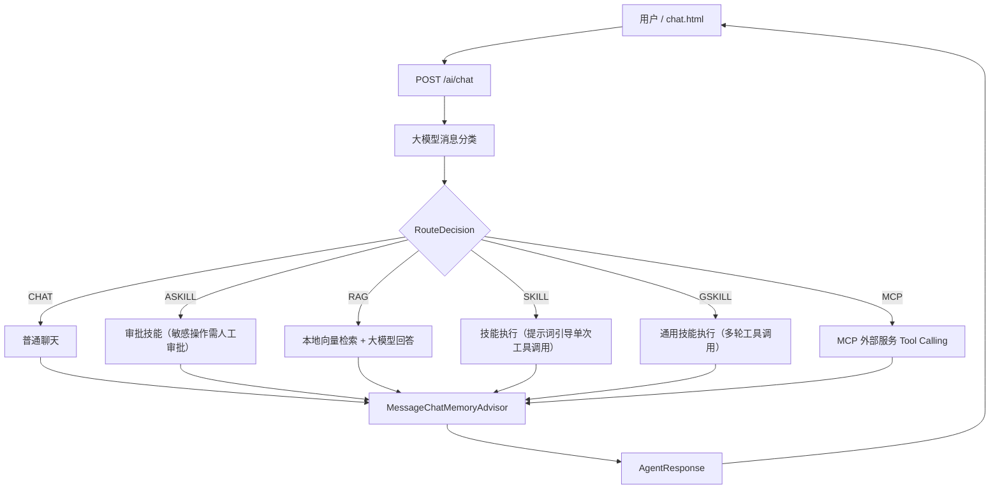
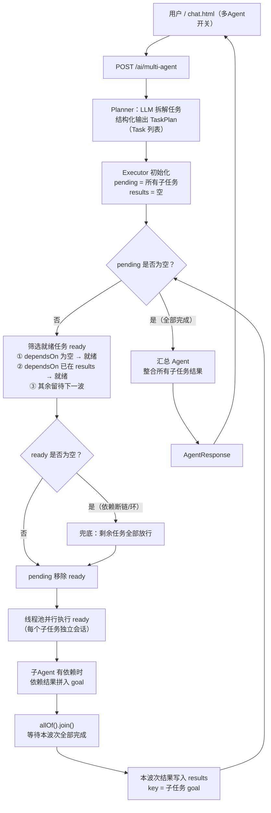
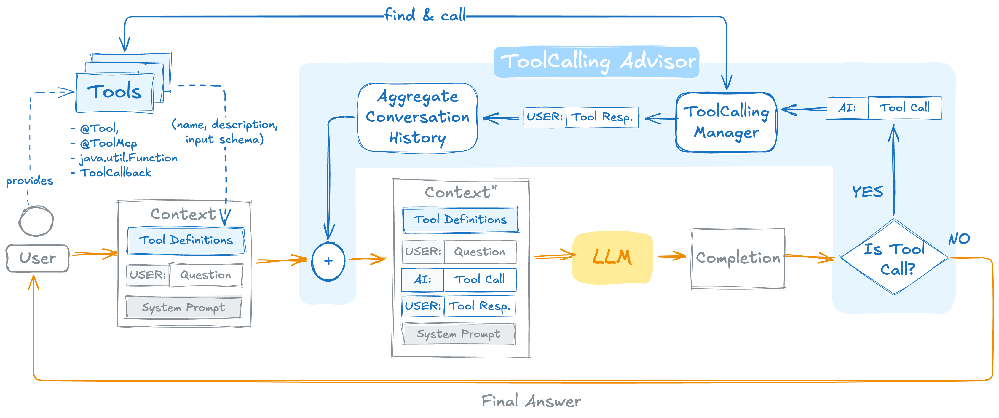

# Sagent

Sagent 是一个基于 Spring AI 2.0 的智能 Agent 示例项目，实现了多类型消息路由、工具调用、技能系统等核心功能。

用户发送消息后，系统先调用大模型进行消息分类，再根据分类结果路由到普通聊天、RAG 知识库检索、审批技能、技能执行或通用技能执行流程。聊天模型通过 DeepSeek 调用，Embedding 模型在本地 JVM 中运行。

## 功能特性

- **智能消息分类**：支持 `CHAT`、`ASKILL`、`RAG`、`SKILL`、`GSKILL`、`MCP` 六种消息类型
- **普通聊天**：基于 DeepSeek 的多轮对话能力
- **RAG 知识库检索**：本地 ONNX Embedding + `SimpleVectorStore` 实现高效检索
- **SKILL 企业固定技能**：提示词引导单次调用单一工具（仍走工具调用循环，仅约束 LLM 一次只选一个工具）
  - `WebPageDownloadSkill`：网页下载处理（截图、下载内容、下载媒体、压缩打包）
  - `DocumentSkill`：生成 Markdown 文档、读取已生成文档内容、生成文本文件
- **GSKILL 通用技能**：由大模型决定调用工具计划，支持多轮工具调用循环
  - `DataBaseSkill`：H2 内存数据库查询
  - `AlarmSkill`：获取时间、设置闹钟
- **ASKILL 审批技能**：敏感操作需人工审批，审批通过后自动执行
  - `ApprovalSqlSkill`：产品删除、修改价格、修改库存（需审批）
  - 审批机制：`@Approval(enable=true)` 标记的方法被 LLM 调用时自动创建 PENDING 记录
  - 审批面板：前端 Element UI 表格展示待审批项，支持批准/拒绝
  - 自动执行：批准后通过 `ToolRegistry` 重新唤起原始工具方法执行业务逻辑
  - 用户查询：内置 `getMyApprovals()`、`checkApprovalById()` 查询审批状态
- **MCP 外部服务**：通过 MCP 协议调用外部工具（计算器、天气、股票查询等），采用延迟初始化，不影响主应用启动
- **文件管理**：支持生成的文档、图片和压缩包下载，图片显示缩略图，点击可下载原图；中文文件名通过 RFC 5987 `filename*` 编码，避免 Tomcat 丢弃含非 ASCII 字符的 `Content-Disposition` 响应头
- **多轮会话记忆**：基于 `MessageChatMemoryAdvisor` 的会话管理
- **多 Agent 编排（演示版）**：Planner 拆解任务 → Executor 按依赖并行执行（复用现有 Handler）→ 汇总 Agent 生成最终回答，支持"查询数据 → 生成文档"等复合任务（详见附录章节）
- **前端界面**：Vue 2 + Element UI 聊天测试页面
- **详细响应**：返回路由类型、分类理由和 RAG 来源

## 技术栈

| 技术 | 版本或用途 |
| --- | --- |
| JDK | 21 |
| Spring Boot | 4.1.0 |
| Spring AI | 2.0.0 |
| DeepSeek | OpenAI 兼容聊天接口 |
| Transformers | 本地运行 ONNX Embedding |
| SimpleVectorStore | 内存向量库 |
| H2 | 内存数据库 |
| Vue 2 / Element UI | 聊天页面 |

## 工作流程


```mermaid
flowchart TD
    U["用户 / chat.html"] --> C["POST /ai/chat"]
    C --> R["大模型消息分类"]
    R --> D{"RouteDecision"}
    D -->|"CHAT"| CH["普通聊天"]
    D -->|"ASKILL"| AS["审批技能（敏感操作需人工审批）"]
    D -->|"RAG"| RA["本地向量检索 + 大模型回答"]
    D -->|"SKILL"| SK["技能执行（提示词引导单次工具调用）"]
    D -->|"GSKILL"| GS["通用技能执行（多轮工具调用）"]
    D -->|"MCP"| MC["MCP 外部服务 Tool Calling"]
    CH --> M["MessageChatMemoryAdvisor"]
    AS --> M
    RA --> M
    SK --> M
    GS --> M
    MC --> M
    M --> A["AgentResponse"]
    A --> U
```

**设计要点**：
- 分类器会读取历史消息来理解上下文，但不会使用会自动写入消息的记忆 Advisor，避免把 `RouteDecision` 写入正式聊天记录。分类优先级：`SKILL > GSKILL > ASKILL > RAG > MCP > CHAT`
- **双窗口记忆架构**：CHAT/RAG 使用大窗口记忆（20条消息），保证多轮对话连贯；SKILL/GSKILL/ASKILL/MCP 使用小窗口记忆（4条消息），让旧查询结果快速淘汰，迫使 LLM 重新调用工具获取最新数据
- SKILL 提示词引导单次调用单一工具（框架仍走工具调用循环，仅约束 LLM 一次只选一个工具；GSKILL 不约束，模型一次响应可含多个工具调用，框架会全部执行后回填继续循环）
- GSKILL/MCP 工具调用循环由 Spring AI 的 `ToolCallingAdvisor` 自动处理
- ASKILL 敏感操作需人工审批，审批通过后通过 `ToolRegistry` 重新调用原始方法执行业务逻辑

## 项目结构

```text
src/main/java/com/example/sagent
├─ agent
│  ├─ core          Agent 核心调度层
│  │  ├─ AgentHandler      处理器接口
│  │  └─ AgentService      Agent 服务（消息路由）
│  ├─ approval      审批系统
│  │  ├─ Approval.java               @Approval 注解
│  │  ├─ ApprovalAspect.java         @Aspect 切面拦截
│  │  ├─ ApprovalService.java        审批核心服务
│  │  ├─ ApprovalBypass.java         ThreadLocal 绕过标志
│  │  ├─ ToolRegistry.java           工具注册表
│  │  └─ UserIdResolver.java         用户 ID 解析器
│  ├─ handlers      Agent 处理器实现
│  │  ├─ ChatHandler       普通聊天处理器
│  │  ├─ ASkillHandler     ASKILL 审批技能处理器
│  │  ├─ RagHandler        RAG 检索处理器
│  │  ├─ SkillHandler      SKILL 企业技能处理器
│  │  ├─ GSkillHandler     GSKILL 通用技能处理器
│  │  └─ McpHandler        MCP 外部服务处理器
│  ├─ skills        技能实现
│  │  ├─ ASkill            ASKILL 接口
│  │  ├─ ApprovalSqlSkill    审批 SQL 技能（ASKILL）
│  │  ├─ ApprovalContext     审批上下文（ThreadLocal）
│  │  ├─ Skill             SKILL 接口
│  │  ├─ GSkill            GSKILL 接口
│  │  ├─ DataBaseSkill     数据库查询技能（GSKILL）
│  │  ├─ WebPageDownloadSkill  网页下载技能（SKILL）
│  │  ├─ DocumentSkill         文档生成/读取技能（SKILL）
│  │  └─ AlarmSkill            闹钟技能（GSKILL）
│  ├─ tools         工具类
│  │  └─ VectorKnowledgeRetriever  向量知识库检索器
│  ├─ memory        会话记忆
│  │  ├─ ChatMemoryConfiguration  聊天记忆配置
│  │  └─ ConversationHistory     会话历史管理
│  ├─ model         数据模型
│  │  ├─ AgentType         Agent 类型枚举
│  │  ├─ AgentResponse     响应模型
│  │  ├─ HandlerResult     处理器结果
│  │  ├─ RouteDecision     路由决策
│  │  ├─ Task              多Agent子任务（record）
│  │  ├─ TaskPlan          多Agent任务计划（record）
│  │  ├─ ApprovalRecord    审批记录（record 类型）
│  │  └─ Product           产品实体
│  ├─ multi         多Agent编排
│  │  └─ MultiAgentService   Planner拆解 → Executor并行执行 → 汇总
│  └─ routing       消息路由
│     └─ MessageClassifier  消息分类器
└─ controller       HTTP 接口
   ├─ ChatController       聊天接口
   ├─ ApprovalController   审批接口
   ├─ DataController       数据查询接口（产品、审批列表）
   └─ FileController       文件管理接口

src/main/resources
├─ embedding        内嵌 ONNX Embedding 模型
├─ knowledge        本地知识库文档
├─ static           chat.html 及前端依赖
├─ schema.sql       H2 表结构
├─ data.sql         H2 演示数据
└─ application.yml  应用配置
```

## 运行项目

### 环境要求

- JDK 21
- Maven 3.9+
- DeepSeek API Key

不需要安装 Ollama、Python、Node.js、MySQL 或 Redis。

### 配置 DeepSeek

必须设置环境变量：

```text
DEEPSEEK_API_KEY
```

**安全提示**：不要把真实 API Key 写入 `application.yml` 或提交到 Git。

### 启动 MCP Server（可选）

MCP 功能采用**延迟初始化**设计：agentdemo 启动时不会连接 MCP Server，只在首次收到 MCP 类型请求时才建立连接。因此无需 MCP 时可直接启动 agentdemo。

如需测试 MCP 功能，先启动 MCP Server：

```bash
cd mcpserver
mvn spring-boot:run
```

MCP Server 默认监听 `http://localhost:8081/mcp`，提供以下工具：
- `calculator`: 计算器（支持加减乘除）
- `get_weather`: 获取指定城市天气（北京/上海/广州/深圳/成都）
- `get_stock_price`: 获取股票实时价格（AAPL/GOOGL/MSFT/TSLA/NVDA/BABA/JD）
- `get_system_info`: 获取系统信息
- `echo`: 回显消息（测试用）

MCP Server 地址通过 `mcp.server.url` 配置（默认 `http://localhost:8081/mcp`），可在 `application.yml` 中覆盖。

### 启动 Agent Demo

**Windows PowerShell**：

```powershell
$env:DEEPSEEK_API_KEY = "你的真实Key"
cd agentdemo
mvn spring-boot:run
```

**macOS / Linux**：

```bash
export DEEPSEEK_API_KEY="你的真实Key"
cd agentdemo
mvn spring-boot:run
```

**IDEA 配置**：
将 Project SDK 设置为 JDK 21，并在 `Run -> Edit Configurations -> Environment variables` 中添加环境变量。

## 聊天页面

启动后访问：

```text
http://localhost:8080/chat.html
```

页面功能：
- 多轮 Agent 对话
- 多Agent编排开关：开启后走 `/ai/multi-agent`，由 Planner 拆解任务并行执行并汇总
- 路由类型和分类原因展示
- RAG 来源展示
- 请求耗时展示
- 停止请求
- 清空页面和服务端会话记忆
- 下载链接渲染（SKILL 生成的文件，图片显示缩略图）
- 审批面板（查看待审批项，支持批准/拒绝）
- 产品查询面板（查看当前数据库产品，用于核对审批操作结果）

页面使用项目内的 Vue 和 Element UI 资源，不需要前端构建。

## API 接口

### 发送消息

```http
POST /ai/chat
Content-Type: application/json
```

请求体：

```json
{
  "conversationId": "demo-1",
  "message": "DEEPSEEK_API_KEY 在哪里配置？"
}
```

响应：

```json
{
  "conversationId": "demo-1",
  "answer": "项目从 DEEPSEEK_API_KEY 环境变量读取 API Key。",
  "type": "RAG",
  "routeReason": "用户询问项目配置",
  "sources": [
    "sagent-overview.md"
  ]
}
```

**参数说明**：
- `conversationId`（可选）：会话 ID，不传时服务端自动生成
- `message`：用户消息内容

**注意**：当前接口一次性返回完整 JSON，不是 SSE 流式响应。

### 会话管理

```http
DELETE /ai/conversations/{conversationId}
```

清空指定会话的服务端记忆（返回 204）。

### 多 Agent 编排

```http
POST /ai/multi-agent
Content-Type: application/json
```

请求体：

```json
{
  "conversationId": "demo-1",
  "message": "查询所有产品的信息，然后生成一份markdown文档保存下来"
}
```

响应：`AgentResponse` 结构同 `/ai/chat`，`type` 固定为 `multi-agent`。流程为 Planner 结构化输出任务列表 → Executor 按依赖并行执行子 Agent → 汇总 Agent 整合结果，汇总回答末尾保留所有 `/files/download/` 下载链接。

### 审批接口

```http
GET /ai/approvals/pending
```

查询待审批记录。

```http
GET /ai/approvals/all
```

查询全部审批记录（含已通过、已拒绝）。

```http
POST /ai/approvals/{id}/approve
```

批准指定审批记录，系统会自动执行原始操作。

```http
POST /ai/approvals/{id}/reject
```

拒绝指定审批记录。

### 数据查询接口

```http
GET /api/products
```

查询全部产品，用于核对审批操作结果。

```http
GET /api/approvals
```

查询全部审批记录（独立路径，无 AI 会话依赖）。

### 文件下载

```http
GET /files/download/{*filename}
```

下载 SKILL 生成的文件（Markdown、文本、图片、压缩包等），会触发浏览器下载。支持子目录路径（如 `/files/download/folderName/file.png`）。

### 文件预览

```http
GET /files/preview/{*filename}
```

预览文件（不触发下载），主要用于图片缩略图展示。支持子目录路径。

### 列出文件

```http
GET /files/list
```

列出所有可下载的文件，包含子目录路径。

## 测试示例

### 普通聊天

```text
你好，请介绍一下你自己。
```

### RAG 知识库查询

```text
DEEPSEEK_API_KEY 在哪里配置？
Why was 1998 SH2 reclassified as a comet?
What does WHO recommend to reduce dementia risk?
```

### 数据库查询（GSKILL）

```text
数据库里有多少个产品？
查询价格不超过 70 元的产品。
```

### SKILL 网页下载与文档生成

```text
下载这个网页 https://example.com 并生成文档。
截取百度首页的截图。
下载网页中的图片。
抓取网页内容并转换为 Markdown。
生成一份关于产品介绍的报告文档。
```

### GSKILL 通用技能

```text
现在几点了？
帮我设置一个5分钟后的闹钟。
```

### ASKILL 审批技能

```text
删除产品 3
修改产品 1 的价格为 199
查询我的审批状态
查看编号 xxx 的审批
```

### MCP 外部服务

```text
帮我算一下 123 + 456
查询北京的天气
苹果股价现在多少？
获取系统信息
```

### 多轮记忆

```text
第一轮：介绍一下 NASA 的那篇新闻。
第二轮：它为什么被重新分类？
```

### 多 Agent 编排

需要先在聊天页面开启"多Agent"开关：

```text
查询所有产品的信息，然后生成一份markdown文档保存下来。
根据知识库介绍Sagent项目，并生成一份总结文档。
```

## 自动化测试

```bash
mvn test
```

测试覆盖：
- 消息分类器测试
- 向量知识库检索器测试

## 注意事项

- 会话记忆、向量库和 H2 数据都保存在内存中，应用重启后会清空
- 双窗口记忆架构：CHAT/RAG 使用大窗口（20条消息），工具类处理器（SKILL/GSKILL/ASKILL/MCP）使用小窗口（4条消息），防止 LLM 复述历史查询结果而不重新调用工具
- RAG 知识文件位于 `src/main/resources/knowledge`
- 数据库查询走 GSKILL/DataBaseSkill，删除和修改操作需通过 ASKILL/ApprovalSqlSkill 审批后方可执行
- SKILL 生成的文件保存在系统临时目录（`%TEMP%/sagent-downloads/`），应用重启后会清空
- 工具注册采用 Spring AI 原生 `ToolCallback` 机制（`ToolCallbacks.from()` + `StaticToolCallbackResolver`），参数类型转换（含泛型 JSON 反序列化）由框架自动完成，无需手写反射转换
- MCP 客户端采用延迟初始化：不注册为 Spring Bean，由 `McpHandler` 在首次 MCP 请求时手动创建连接，避免启动时因 MCP Server 未就绪而导致应用启动失败。若连接失败会返回友好提示，不会阻塞其他功能
- ASKILL 审批机制：带 `@Approval(enable=true)` 注解的方法通过 AOP 切面拦截，自动创建 PENDING 记录并返回等待人工审批；查询类方法（`getMyApprovals`、`checkApprovalById`）无需审批直接放行
- 这是学习和功能验证项目，生产环境还需要鉴权、限流、持久化和安全审查

## 附录：多 Agent 编排（演示版）

多 Agent 编排是独立于单 Agent 路由的实验性功能，作为功能演示单独介绍。它不改变原有的消息分类机制——前端通过"多Agent"开关选择走 `/ai/multi-agent`，普通入口仍走 `/ai/chat` 单 Agent 路由。

核心思路：**Planner 拆解任务 → Executor 调度执行（复用现有 Handler）→ 汇总 Agent 生成最终回答**，编排层只负责"拆解、调度、汇总"，不重复实现 Agent 能力。


```mermaid
flowchart TD
    U2["用户 / chat.html（多Agent开关）"] --> P["POST /ai/multi-agent"]
    P --> PL["Planner：LLM 拆解任务<br/>结构化输出 TaskPlan（Task 列表）"]
    PL --> INIT["Executor 初始化<br/>pending = 所有子任务<br/>results = 空"]

    INIT --> WHILE{"pending 是否为空？"}
    WHILE -- "否" --> FILTER["筛选就绪任务 ready<br/>① dependsOn 为空 → 就绪<br/>② dependsOn 已在 results → 就绪<br/>③ 其余留待下一波"]
    FILTER --> EMPTY{"ready 是否为空？"}
    EMPTY -- "是（依赖断链/环）" --> FALLBACK["兜底：剩余任务全部放行"]
    EMPTY -- "否" --> REMOVE["pending 移除 ready"]
    FALLBACK --> REMOVE
    REMOVE --> RUN["线程池并行执行 ready<br/>（每个子任务独立会话）"]
    RUN --> INJECT["子Agent 有依赖时<br/>依赖结果拼入 goal"]
    INJECT --> JOIN["allOf().join()<br/>等待本波次全部完成"]
    JOIN --> STORE["本波次结果写入 results<br/>key = 子任务 goal"]
    STORE --> WHILE

    WHILE -- "是（全部完成）" --> AGG["汇总 Agent<br/>整合所有子任务结果"]
    AGG --> RESP["AgentResponse"]
    RESP --> U2
```

**波次示意**（示例：查询产品 → 生成文档，Planner 输出 2 个子任务）：

| 波次 | 就绪任务 | 说明 |
| --- | --- | --- |
| 波次 1 | T1（GSKILL，无依赖） | 直接就绪，线程池执行，结果写入 results |
| 波次 2 | T2（SKILL，dependsOn=T1.goal） | 依赖已在 results → 就绪，把 T1 结果拼入 goal 后执行 |
| 波次 3 | 无 | pending 为空，循环结束，进入汇总 |

依赖任务总是比其依赖晚一个波次，无依赖任务可并行；循环次数 = 任务依赖链的最大深度 + 1。

**与 GSKILL 的区别**：

| 对比维度 | 多 Agent 编排 | GSKILL 通用技能 |
| --- | --- | --- |
| 入口 | `/ai/multi-agent`（前端多Agent开关） | `/ai/chat`（消息分类自动路由） |
| 执行模型 | 多个独立子 Agent：Planner 拆解 → Executor 并行执行 → 汇总 Agent 整合 | 单个 Agent 内多轮工具调用循环（`ToolCallingAdvisor` 自动处理） |
| 任务拆分 | Planner 结构化输出 TaskPlan，按类型拆成多个子任务 | 不拆任务，同一 LLM 依据上下文连续调用工具 |
| 并发能力 | 线程池并行：同波次无依赖子任务并发执行 | 单 Agent 内工具级并发：一次响应含多个工具调用时，框架逐个全部执行后合并回填 |
| 依赖处理 | 支持 `dependsOn`，依赖结果拼入子任务 goal | 无显式依赖，靠对话历史传递中间结果 |
| 工具范围 | 子任务可跨类型调用（RAG/GSKILL/SKILL/ASKILL/MCP/CHAT） | 仅当前绑定的一组 GSkill 工具 |
| 会话/记忆 | 每个子任务独立会话 ID，互不污染 | 单会话，小窗口记忆（4 条消息） |
| 结果组织 | 汇总 Agent 统一整合，强制保留下载链接 | LLM 直接总结工具调用结果 |
| 适用场景 | 跨能力、可并行、有依赖的复合任务（如"查询产品 → 生成文档"） | 单一领域内多步工具组合（如"查产品 → 统计数量 → 筛选价格"） |

**多 Agent 要点**：
- 每个子任务使用独立会话 ID 执行，避免污染主会话
- 子任务声明 `dependsOn` 时，将依赖任务的执行结果拼入 goal，供子 Agent 参考（如"生成文档"依赖"查询产品数据"）
- 汇总阶段强制保留子任务结果中的 `/files/download/` 下载链接，并有正则兜底提取

## 附录：工具调用循环

Spring AI 2.0 将工具调用循环从 ChatModel 内部抽取为 `ToolCallingAdvisor` 递归顾问，作为顾问链的一部分统一管理。



**核心机制**：

1. `ToolCallingAdvisor` 是递归顾问，通过 `callAdvisorChain.copy(this)` 创建子链进行循环调用
2. `ChatClient` 自动注册 `ToolCallingAdvisor`（默认优先级 `HIGHEST_PRECEDENCE + 300`）
3. 循环过程：注入工具定义 → 调用LLM → 执行工具 → 回填结果 → **再次调用LLM** → 循环
4. 停止条件：LLM 返回不含工具调用的最终响应

**关键流程**：
- 循环的主体是**调用工具**，每次循环都会调用LLM来决定是否继续调用工具
- 每次工具调用后，结果会追加到对话历史，然后**再次调用LLM**
- 最终LLM根据所有工具结果，生成自然语言回复给用户

**应用只需**：
- 通过 `.tools()` 注册工具对象
- 使用 `@Tool` 注解定义可调用方法

## License

MIT License
