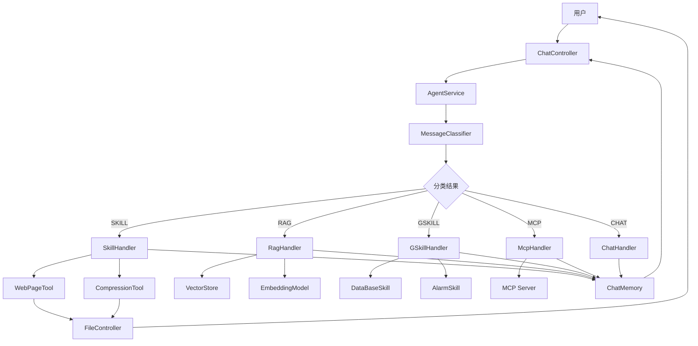

# 从零构建智能 Agent：消息分类、RAG 检索与工具调用循环深度解析

## 一、项目背景

[Sagent](https://github.com/hdwang123/sagent) 是一个基于 Spring AI 2.0 的智能 Agent 示例项目，实现了完整的消息路由、知识库检索和工具调用能力。本文将深入剖析其核心机制，帮助你理解如何从零构建一个生产级智能 Agent。

---

## 二、消息分类：Agent 的大脑决策

消息分类是 Agent 的入口决策层，决定用户请求应该走哪条处理路径。

### 2.1 分类体系设计

我们设计了五种消息类型，按优先级从高到低排列：

| 类型 | 场景 | 特点 |
|------|------|------|
| **SKILL** | 企业固定技能 | 单次调用单一工具，不进入循环 |
| **RAG** | 知识库查询 | 本地向量检索 + LLM 回答 |
| **GSKILL** | 通用技能 | 多轮工具调用循环 |
| **MCP** | 外部服务 | 通过 MCP 协议调用外部工具 |
| **CHAT** | 普通聊天 | 兜底的通用对话 |

这种优先级设计确保了精确匹配的任务不会被通用逻辑"吞没"。

### 2.2 分类器实现

核心逻辑在 `MessageClassifier.java`：

```java
@Tool(description = "根据用户消息内容进行分类")
public RouteDecision classify(String message) {
    String prompt = """
        你是一个消息分类器，根据以下规则对用户消息进行分类：
        
        SKILL（最高优先级）：组合技能（单次调用），不含数据库查询
        关键词：网页下载、截图、文件下载、压缩打包
        
        RAG：知识库查询
        关键词：Sagent、项目说明、路由规则、知识库、文档、手册
        
        GSKILL：通用技能（循环调用）
        关键词：数据库、产品查询、时间、闹钟
        
        MCP：外部服务
        关键词：计算器、天气、股票、系统信息、回显
        
        CHAT：其他通用对话
        
        请严格按照优先级判断，返回格式：{"type": "SKILL", "reason": "xxx"}
        """;
    
    // 调用 LLM 获取分类结果
    String response = chatClient.prompt(prompt + "\n用户消息：" + message)
                                .call()
                                .content();
    
    return parseRouteDecision(response);
}
```

### 2.3 关键设计要点

**分类器不使用会话记忆**：分类器使用独立的 `ChatClient`，不注入 `MessageChatMemoryAdvisor`，避免把分类决策写入正式聊天记录。

```java
// MessageClassifier 中的 ChatClient
private final ChatClient classifierClient;

// 通过构造函数注入，不包含 memoryAdvisor
public MessageClassifier(ChatModel chatModel) {
    this.classifierClient = ChatClient.builder(chatModel).build();
}
```

---

## 三、RAG 原理：让 LLM 拥有领域知识

RAG（Retrieval-Augmented Generation）是让大模型回答特定领域问题的核心技术。

### 3.1 RAG 完整流程

```
用户提问 → 文本向量化 → 向量检索 → LLM 重排序 → 生成回答
```

### 3.2 文本向量化

使用本地 ONNX 模型进行 Embedding：

```java
// RagHandler.java
private final EmbeddingModel embeddingModel;

public String generateAnswer(String query, List<Document> documents) {
    // 1. 将查询文本向量化
    Embedding queryEmbedding = embeddingModel.embed(query);
    
    // 2. 在向量库中检索相似文档
    List<Document> retrievedDocs = vectorStore.similaritySearch(queryEmbedding, 5);
    ...
}
```

### 3.3 混合检索策略

我们实现了**关键词检索 + 向量检索**的混合策略：

```java
// VectorKnowledgeRetriever.java
public List<Document> hybridSearch(String query) {
    // 1. 关键词检索
    List<Document> keywordResults = keywordSearch(query);
    
    // 2. 向量检索
    List<Document> vectorResults = vectorSearch(query);
    
    // 3. 去重合并
    Set<Document> combined = new LinkedHashSet<>();
    combined.addAll(vectorResults);
    combined.addAll(keywordResults);
    
    return new ArrayList<>(combined);
}
```

### 3.4 LLM 重排序

检索结果可能包含噪声，我们使用 LLM 进行智能重排序：

```java
// RagHandler.java
private List<Document> llmRerank(String query, List<Document> documents) {
    // 使用独立的 rerankClient，避免会话记忆干扰
    String prompt = """
        根据与查询的相关性对以下文档进行排序，返回排序后的索引（逗号分隔）：
        查询：%s
        文档：%s
        """;
    
    String response = rerankClient.prompt(String.format(prompt, query, documents))
                                  .call()
                                  .content();
    
    return reorderDocuments(documents, parseIndices(response));
}
```

**关键坑点**：`rerankClient` 必须独立创建，不能复用带 `MessageChatMemoryAdvisor` 的 `chatClient`，否则会报 `conversationId cannot be null` 错误。

### 3.5 最终回答生成

将检索到的上下文注入 LLM 提示词：

```java
private String generateAnswer(String query, List<Document> documents) {
    String context = documents.stream()
        .map(d -> d.getContent())
        .collect(Collectors.joining("\n---\n"));
    
    String prompt = """
        基于以下上下文回答用户问题：
        
        %s
        
        用户问题：%s
        
        如果上下文没有相关信息，请直接回答，不要编造。
        """;
    
    return chatClient.prompt(String.format(prompt, context, query))
                     .call()
                     .content();
}
```

---

## 四、工具调用循环：让 Agent 具备执行能力

工具调用是 Agent 从"聊天机器人"进化为"智能助手"的关键。

### 4.1 Spring AI 2.0 的工具调用机制

Spring AI 2.0 将工具调用循环从 `ChatModel` 内部抽取为 `ToolCallingAdvisor` 递归顾问：

```
注入工具定义 → 调用 LLM → LLM 返回工具调用请求 → 执行工具 → 回填结果 → 再次调用 LLM → 循环
```

### 4.2 工具注册方式

通过 `@Tool` 注解定义工具，然后通过 `.tools()` 注册到 `ChatClient`：

```java
// DataBaseSkill.java - GSKILL 示例
@Component
public class DataBaseSkill implements GSkill {
    
    @Tool(description = "查询产品数量")
    public String getProductCount() {
        return "产品总数：" + productRepository.count();
    }
    
    @Tool(description = "查询指定价格范围内的产品")
    public String searchProductsByPrice(
        @ToolParam(description = "最低价格") double minPrice,
        @ToolParam(description = "最高价格") double maxPrice
    ) {
        List<Product> products = productRepository.findByPriceBetween(minPrice, maxPrice);
        return formatProducts(products);
    }
}
```

### 4.3 工具调用配置

```java
// SkillHandler.java
public HandlerResult handle(String message, String conversationId) {
    ChatClient chatClient = ChatClient.builder(chatModel)
        .defaultSystem("找到一个最合适的工具即可调用，不要调用多个工具")
        .build();
    
    // 注册工具
    chatClient = chatClient.tools(webPageTool, compressionTool);
    
    // 调用工具并获取结果
    String result = chatClient.prompt(message)
        .call()
        .content();
    
    return HandlerResult.success(result);
}
```

### 4.4 SKILL vs GSKILL 的区别

| 特性 | SKILL（企业固定技能） | GSKILL（通用技能） |
|------|---------------------|-------------------|
| 调用模式 | 单次调用，不进入循环 | 多轮工具调用循环 |
| LLM 角色 | 工具选择器 | 工具选择器 + 任务规划者 |
| 适用场景 | 明确的单一步骤任务 | 需要多步骤协作的复杂任务 |
| 示例 | 截图、下载网页 | 数据库查询、多步计算 |

### 4.5 循环停止条件

`ToolCallingAdvisor` 的循环在以下情况停止：

1. **LLM 返回不含工具调用的响应** — 这是正常结束
2. **达到最大循环次数** — 防止无限循环
3. **工具执行失败** — 返回错误信息

---

## 五、完整架构



---

## 六、关键技术总结

### 6.1 内存隔离

- **分类器内存**：独立的 `ChatClient`，不使用记忆
- **处理器内存**：共享 `MessageChatMemoryAdvisor`，支持多轮对话
- **重排序内存**：独立的 `rerankClient`，避免会话 ID 干扰

### 6.2 安全约束

- 文件操作限制在系统临时目录
- 工具调用限制单次调用（SKILL）或受控循环（GSKILL）
- 路径遍历攻击防护

### 6.3 延迟初始化

MCP 客户端采用延迟初始化，首次请求时才建立连接，避免启动依赖。

---

## 七、快速上手

```bash
# 克隆项目
git clone https://github.com/hdwang123/sagent.git

# 设置环境变量
export OPENROUTER_API_KEY="你的Key"

# 启动项目
cd agentdemo
mvn spring-boot:run

# 访问聊天页面
http://localhost:8080/chat.html
```

---

## 八、结语

智能 Agent 的核心在于**决策（消息分类）、知识（RAG）和执行（工具调用）**三者的有机结合。Sagent 项目展示了如何基于 Spring AI 2.0 构建一个架构清晰、功能完整的智能 Agent 系统。

如果你正在构建自己的 Agent 系统，希望本文能给你带来启发。欢迎在 GitHub 上 Star 和 Fork 项目，一起交流学习！

---

**项目地址**：[https://github.com/hdwang123/sagent](https://github.com/hdwang123/sagent)