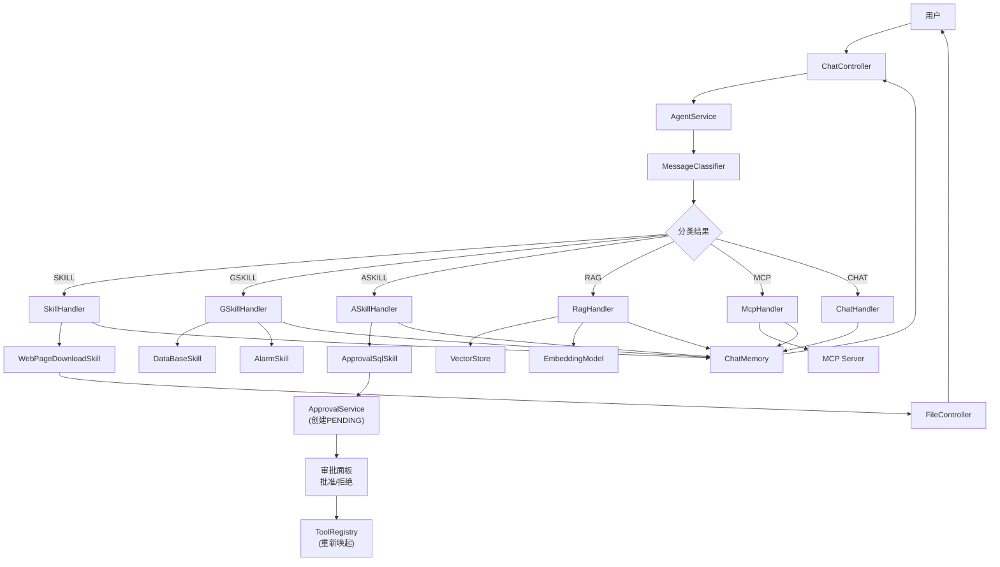

# 从零构建智能 Agent：消息分类、RAG 检索与工具调用循环深度解析

## 一、项目背景

在大语言模型（LLM）飞速发展的今天，智能 Agent 已成为 AI 应用的重要形态。一个完整的智能 Agent 需要具备四大核心能力：

1. **决策能力**：理解用户意图并选择正确的处理路径
2. **知识能力**：拥有领域知识，回答专业问题
3. **执行能力**：调用工具完成实际任务
4. **安全能力**：敏感操作需人工审批方可执行

[Sagent](https://github.com/hdwang123/sagent) 正是基于这四大能力构建的智能 Agent 示例项目。它基于 Spring AI 2.0 框架，实现了完整的消息路由、知识库检索和工具调用能力，是学习和理解智能 Agent 架构的优秀参考。

### 1.1 为什么选择 Spring AI 2.0

Spring AI 2.0 是 Spring 官方推出的 AI 应用开发框架，相比其他框架具有以下优势：

- **与 Spring 生态无缝集成**：天然支持 Spring Boot、Spring Cloud 等生态
- **标准化的工具调用机制**：内置 `ToolCallingAdvisor` 实现自动工具调用循环
- **灵活的记忆管理**：支持多种会话记忆策略
- **多模型支持**：一键切换不同的 LLM 提供商

### 1.2 项目目标

Sagent 项目旨在展示如何构建一个生产级智能 Agent，具体目标包括：

- 实现完整的消息分类和路由机制
- 演示 RAG 知识库检索的最佳实践
- 展示工具调用循环的实现方式
- 展示敏感操作的审批安全机制
- 提供可复用的技能和工具抽象
- 构建友好的前端交互界面

---

## 二、技术栈介绍

Sagent 采用了现代化的技术栈，确保项目的稳定性和可扩展性。

### 2.1 核心技术

| 技术 | 版本 | 用途 |
|------|------|------|
| **JDK** | 21 | 项目运行环境，支持虚拟线程等新特性 |
| **Spring Boot** | 4.1.0 | 应用框架，提供便捷的依赖管理和自动配置 |
| **Spring AI** | 2.0.0 | AI 应用开发框架，核心依赖 |
| **OpenRouter** | - | LLM 接入平台，提供多模型支持 |

### 2.2 机器学习组件

| 技术 | 用途 |
|------|------|
| **Transformers** | 本地运行 ONNX Embedding 模型 |
| **SimpleVectorStore** | 内存向量库，存储和检索文档向量 |
| **all-MiniLM-L6-v2** | 轻量级 Embedding 模型（ONNX 格式） |

### 2.3 数据存储

| 技术 | 用途 |
|------|------|
| **H2** | 内存数据库，存储产品数据供查询测试 |
| **System Temporary Directory** | 文件存储，保存下载的网页、图片和压缩包 |

### 2.4 前端技术

| 技术 | 用途 |
|------|------|
| **Vue 2** | 前端框架，构建聊天界面 |
| **Element UI** | UI 组件库，提供美观的界面组件 |

### 2.5 MCP 协议

MCP（Model Context Protocol）是一种标准化的工具调用协议，用于连接 LLM 和外部工具。Sagent 通过 MCP 协议调用外部服务，实现计算器、天气查询、股票查询等功能。

---

## 三、消息分类：Agent 的大脑决策

消息分类是 Agent 的入口决策层，决定用户请求应该走哪条处理路径。

### 3.1 分类体系设计

我们设计了六种消息类型，按优先级从高到低排列：

| 类型 | 场景 | 特点 |
|------|------|------|
| **SKILL** | 企业固定技能 | 单次调用单一工具，不进入循环 |
| **GSKILL** | 通用技能 | 多轮工具调用循环 |
| **ASKILL** | 审批技能 | 敏感操作需人工审批后执行 |
| **RAG** | 知识库查询 | 本地向量检索 + LLM 回答 |
| **MCP** | 外部服务 | 通过 MCP 协议调用外部工具 |
| **CHAT** | 普通聊天 | 兜底的通用对话 |

这种优先级设计确保了精确匹配的任务不会被通用逻辑"吞没"。

### 3.2 分类器实现

核心逻辑在 `MessageClassifier.java`：

```java
@Tool(description = "根据用户消息内容进行分类")
public RouteDecision classify(String message) {
    String prompt = """
        你是一个消息分类器，根据以下规则对用户消息进行分类：
        
        SKILL（最高优先级）：组合技能（单次调用），不含数据库查询
        关键词：网页下载、截图、文件下载、压缩打包
        
        RAG：知识库查询
        关键词：Sagent、项目说明、路由规则、知识库、文档、手册
        
        GSKILL：通用技能（循环调用）
        关键词：数据库、产品查询、时间、闹钟
        
        ASKILL：审批技能
        关键词：删除产品、修改价格、修改库存等敏感数据库操作
        
        MCP：外部服务
        关键词：计算器、天气、股票、系统信息、回显
        
        CHAT：其他通用对话
        
        请严格按照优先级判断，返回格式：{"type": "SKILL", "reason": "xxx"}
        """;
    
    // 调用 LLM 获取分类结果
    String response = chatClient.prompt(prompt + "\n用户消息：" + message)
                                .call()
                                .content();
    
    return parseRouteDecision(response);
}
```

### 3.3 关键设计要点

**分类器不使用会话记忆**：分类器使用独立的 `ChatClient`，不注入 `MessageChatMemoryAdvisor`，避免把分类决策写入正式聊天记录。

```java
// MessageClassifier 中的 ChatClient
private final ChatClient classifierClient;

// 通过构造函数注入，不包含 memoryAdvisor
public MessageClassifier(ChatModel chatModel) {
    this.classifierClient = ChatClient.builder(chatModel).build();
}
```

---

## 四、RAG 原理：让 LLM 拥有领域知识

RAG（Retrieval-Augmented Generation）是让大模型回答特定领域问题的核心技术。

### 4.1 RAG 完整流程

```
用户提问 → 文本向量化 → 向量检索 → LLM 重排序 → 生成回答
```

### 4.2 文本向量化

使用本地 ONNX 模型进行 Embedding：

```java
// RagHandler.java
private final EmbeddingModel embeddingModel;

public String generateAnswer(String query, List<Document> documents) {
    // 1. 将查询文本向量化
    Embedding queryEmbedding = embeddingModel.embed(query);
    
    // 2. 在向量库中检索相似文档
    List<Document> retrievedDocs = vectorStore.similaritySearch(queryEmbedding, 5);
    ...
}
```

### 4.3 混合检索策略

我们实现了**关键词检索 + 向量检索**的混合策略：

```java
// VectorKnowledgeRetriever.java
public List<Document> hybridSearch(String query) {
    // 1. 关键词检索
    List<Document> keywordResults = keywordSearch(query);
    
    // 2. 向量检索
    List<Document> vectorResults = vectorSearch(query);
    
    // 3. 去重合并
    Set<Document> combined = new LinkedHashSet<>();
    combined.addAll(vectorResults);
    combined.addAll(keywordResults);
    
    return new ArrayList<>(combined);
}
```

### 4.4 LLM 重排序

检索结果可能包含噪声，我们使用 LLM 进行智能重排序：

```java
// RagHandler.java
private List<Document> llmRerank(String query, List<Document> documents) {
    // 使用独立的 rerankClient，避免会话记忆干扰
    String prompt = """
        根据与查询的相关性对以下文档进行排序，返回排序后的索引（逗号分隔）：
        查询：%s
        文档：%s
        """;
    
    String response = rerankClient.prompt(String.format(prompt, query, documents))
                                  .call()
                                  .content();
    
    return reorderDocuments(documents, parseIndices(response));
}
```

**关键坑点**：`rerankClient` 必须独立创建，不能复用带 `MessageChatMemoryAdvisor` 的 `chatClient`，否则会报 `conversationId cannot be null` 错误。

### 4.5 最终回答生成

将检索到的上下文注入 LLM 提示词：

```java
private String generateAnswer(String query, List<Document> documents) {
    String context = documents.stream()
        .map(d -> d.getContent())
        .collect(Collectors.joining("\n---\n"));
    
    String prompt = """
        基于以下上下文回答用户问题：
        
        %s
        
        用户问题：%s
        
        如果上下文没有相关信息，请直接回答，不要编造。
        """;
    
    return chatClient.prompt(String.format(prompt, context, query))
                     .call()
                     .content();
}
```

---

## 五、工具调用循环：让 Agent 具备执行能力

工具调用是 Agent 从"聊天机器人"进化为"智能助手"的关键。

### 5.1 Spring AI 2.0 的工具调用机制

Spring AI 2.0 将工具调用循环从 `ChatModel` 内部抽取为 `ToolCallingAdvisor` 递归顾问：

```
注入工具定义 → 调用 LLM → LLM 返回工具调用请求 → 执行工具 → 回填结果 → 再次调用 LLM → 循环
```

### 5.2 工具注册方式

通过 `@Tool` 注解定义工具，然后通过 `.tools()` 注册到 `ChatClient`：

```java
// DataBaseSkill.java - GSKILL 示例
@Component
public class DataBaseSkill implements GSkill {
    
    @Tool(description = "查询产品数量")
    public String getProductCount() {
        return "产品总数：" + productRepository.count();
    }
    
    @Tool(description = "查询指定价格范围内的产品")
    public String searchProductsByPrice(
        @ToolParam(description = "最低价格") double minPrice,
        @ToolParam(description = "最高价格") double maxPrice
    ) {
        List<Product> products = productRepository.findByPriceBetween(minPrice, maxPrice);
        return formatProducts(products);
    }
}
```

### 5.3 工具调用配置

```java
// SkillHandler.java
public HandlerResult handle(String message, String conversationId) {
    ChatClient chatClient = ChatClient.builder(chatModel)
        .defaultSystem("找到一个最合适的工具即可调用，不要调用多个工具")
        .build();
    
    // 注册工具
    chatClient = chatClient.tools(webPageTool, compressionTool);
    
    // 调用工具并获取结果
    String result = chatClient.prompt(message)
        .call()
        .content();
    
    return HandlerResult.success(result);
}
```

### 5.4 SKILL vs GSKILL vs ASKILL 的区别

| 特性 | SKILL（企业固定技能） | GSKILL（通用技能） | ASKILL（审批技能） |
|------|---------------------|-------------------|-------------------|
| 调用模式 | 单次调用，不进入循环 | 多轮工具调用循环 | 敏感操作需人工审批 |
| LLM 角色 | 工具选择器 | 工具选择器 + 任务规划者 | 工具选择器 |
| 适用场景 | 明确的单一步骤任务 | 需要多步骤协作的复杂任务 | 删除、修改等敏感操作 |
| 示例 | 截图、下载网页 | 数据库查询、多步计算 | 删除产品、修改价格 |

### 5.5 循环停止条件

`ToolCallingAdvisor` 的循环在以下情况停止：

1. **LLM 返回不含工具调用的响应** — 这是正常结束
2. **达到最大循环次数** — 防止无限循环
3. **工具执行失败** — 返回错误信息

---

## 六、ASKILL 审批机制：让人在回路中

对于删除产品、修改价格等敏感操作，直接让 LLM 执行存在安全风险。Sagent 引入了 **ASKILL 审批技能**，通过"人在回路中"（Human-in-the-Loop）的审批机制来保障安全。

### 6.1 核心设计理念

LLM 调用敏感工具时，**不直接执行**，而是创建一条审批记录等待人工确认：

```
LLM调用deleteProduct → @Approval AOP拦截 → 创建PENDING记录 → 返回等待审批
用户批准 → ApprovalBypass(ThreadLocal)绕过 → ToolRegistry反射调用原方法 → 真正执行
```

### 6.2 组件职责

| 组件 | 职责 |
|------|------|
| `@Approval(enable=true)` | 标注需要审批的 Tool 方法 |
| `ApprovalAspect` | AOP 切面，拦截 @Approval 方法，自动创建审批记录 |
| `ApprovalService` | 审批记录 CRUD（创建 PENDING、批准、拒绝） |
| `ToolRegistry` | 扫描所有 ASkill Bean 的 @Tool 方法，建立工具名到方法的映射 |
| `ApprovalBypass` | ThreadLocal 标志，审批面板执行时跳过 AOP 拦截 |
| `ApprovalContext` | ThreadLocal 上下文，传递会话 ID 和用户 ID |

### 6.3 ASkill 接口设计

```java
// ASkill.java - 审批技能接口
public interface ASkill {
    String getName();
    String getDescription();
}
```

```java
// ApprovalSqlSkill.java - 审批 SQL 技能实现
@Component
public class ApprovalSqlSkill implements ASkill {
    
    // 查询方法：无需审批，直接放行
    @Tool(description = "查询当前会话的所有审批记录")
    public String getMyApprovals() { ... }
    
    @Tool(description = "根据审批编号查询单个审批状态")
    public String checkApprovalById(String id) { ... }
    
    // 写入方法：带 @Approval，需要审批
    @Tool(description = "删除指定ID的产品")
    @Approval(enable = true)
    public String deleteProduct(Long id) { ... }
    
    @Tool(description = "修改产品价格")
    @Approval(enable = true)
    public String updateProductPrice(Long id, Double newPrice) { ... }
    
    @Tool(description = "修改产品库存")
    @Approval(enable = true)
    public String updateProductStock(Long id, Integer newStock) { ... }
}
```

### 6.4 审批流程详解

**第一步：LLM 调用，AOP 拦截**

```java
// ApprovalAspect.java
@Around("@annotation(approval) && execution(* com.example.sagent.agent.skills.ASkill+.*(..))")
public Object checkApproval(ProceedingJoinPoint joinPoint, Approval approval) {
    if (ApprovalBypass.isEnabled()) {
        return joinPoint.proceed(); // 审批面板直调，跳过拦截
    }
    // 创建 PENDING 记录并返回
    String recordId = approvalService.createPending(
        ApprovalContext.getConversationId(),
        joinPoint.getSignature().getName(),
        joinPoint.getArgs()
    );
    return "PENDING:" + recordId + " 操作已提交审批，请在审批面板中确认";
}
```

**第二步：用户在审批面板批准**

```java
// ApprovalController.java
@PostMapping("/approvals/{id}/approve")
public String approve(@PathVariable String id) {
    ApprovalRecord record = approvalService.findById(id);
    
    // 启用绕过标志，直接执行业务逻辑
    ApprovalBypass.enable();
    try {
        String result = toolRegistry.invokeTool(record.methodName(), record.args());
        approvalService.approve(id);
        return result;
    } finally {
        ApprovalBypass.clear();
    }
}
```

### 6.5 为什么这么设计

这个方案引入了 AOP + ThreadLocal + ToolRegistry 三块基础设施，看似复杂，但这是追求**通用性**必须付出的代价：

- **AOP**：统一拦截所有 @Approval 方法，新增加敏感操作只需加注解，无需改业务代码
- **ThreadLocal**：区分"LLM 调用"和"审批面板执行"两个来源，同一条链路两个角色无缝切换
- **ToolRegistry**：反射扫描 ASkill Bean 的 @Tool 方法，审批通过后自动唤起，不依赖具体类名

去掉任何一个都会牺牲通用性。简化方案（比如审批面板直接调 Service 层 SQL）虽然代码少，但每新增一个敏感操作就需要加 case，不具备复用性。

---

## 七、完整架构


```mermaid
flowchart TD
    U["用户"] --> C["ChatController"]
    C --> AS["AgentService"]
    AS --> MC["MessageClassifier"]
    MC --> D{"分类结果"}
    
    D -->|"SKILL"| SH["SkillHandler"]
    SH --> WT["WebPageDownloadSkill"]
    
    D -->|"GSKILL"| GSH["GSkillHandler"]
    GSH --> DB["DataBaseSkill"]
    GSH --> AK["AlarmSkill"]
    
    D -->|"ASKILL"| AH["ASkillHandler"]
    AH --> APS["ApprovalSqlSkill"]
    APS --> APV["ApprovalService<br/>(创建PENDING)"]
    APV --> UI["审批面板<br/>批准/拒绝"]
    UI --> TR["ToolRegistry<br/>(重新唤起)"]
    
    D -->|"RAG"| RH["RagHandler"]
    RH --> VS["VectorStore"]
    RH --> EM["EmbeddingModel"]
    
    D -->|"MCP"| MH["McpHandler"]
    MH --> MS["MCP Server"]
    
    D -->|"CHAT"| CH["ChatHandler"]
    
    WT --> FC["FileController"]
    
    SH --> MEM["ChatMemory"]
    AH --> MEM
    RH --> MEM
    GSH --> MEM
    MH --> MEM
    CH --> MEM
    
    MEM --> C
    FC --> U
```

---

## 八、关键技术总结

### 8.1 内存隔离

- **分类器内存**：独立的 `ChatClient`，不使用记忆
- **处理器内存**：共享 `MessageChatMemoryAdvisor`，支持多轮对话
- **重排序内存**：独立的 `rerankClient`，避免会话 ID 干扰

### 8.2 安全约束

- 文件操作限制在系统临时目录
- 工具调用限制单次调用（SKILL）或受控循环（GSKILL）
- 敏感操作需人工审批（ASKILL）
- 路径遍历攻击防护

### 8.3 审批安全机制

- **AOP 拦截**：`@Approval(enable=true)` 统一拦截所有敏感 Tool 方法
- **ThreadLocal 隔离**：`ApprovalBypass` 区分 LLM 调用和审批面板执行
- **反射唤起**：`ToolRegistry` 审批通过后自动唤起原始方法
- **会话隔离**：`ApprovalContext` 传递会话 ID，每个会话的审批记录独立

### 8.4 延迟初始化

MCP 客户端采用延迟初始化，首次请求时才建立连接，避免启动依赖。

---

## 九、快速上手

```bash
# 克隆项目
git clone https://github.com/hdwang123/sagent.git

# 设置环境变量
export OPENROUTER_API_KEY="你的Key"

# 启动项目
cd agentdemo
mvn spring-boot:run

# 访问聊天页面
http://localhost:8080/chat.html
```

---

## 十、结语

智能 Agent 的核心在于**决策（消息分类）、知识（RAG）、执行（工具调用）和安全（审批机制）**四者的有机结合。Sagent 项目展示了如何基于 Spring AI 2.0 构建一个架构清晰、功能完整的智能 Agent 系统。

如果你正在构建自己的 Agent 系统，希望本文能给你带来启发。欢迎在 GitHub 上 Star 和 Fork 项目，一起交流学习！

---

**项目地址**：[https://github.com/hdwang123/sagent](https://github.com/hdwang123/sagent)